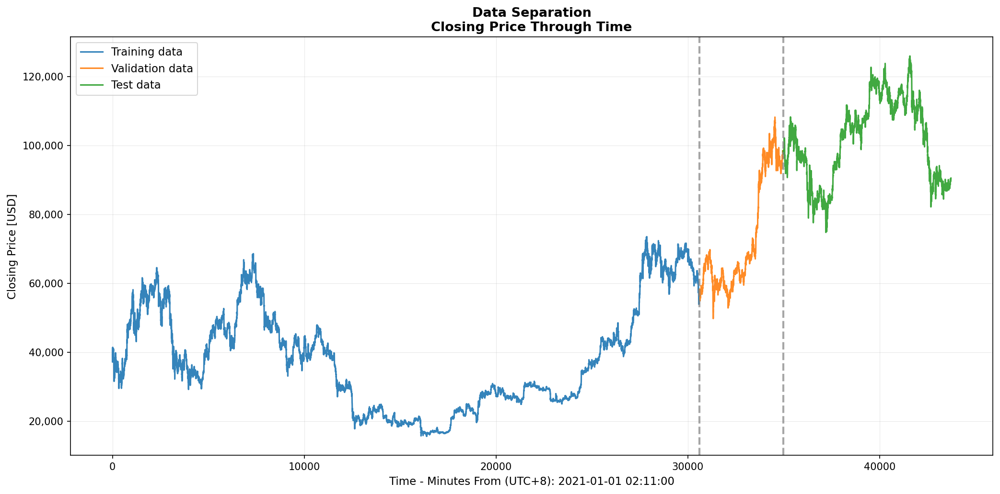
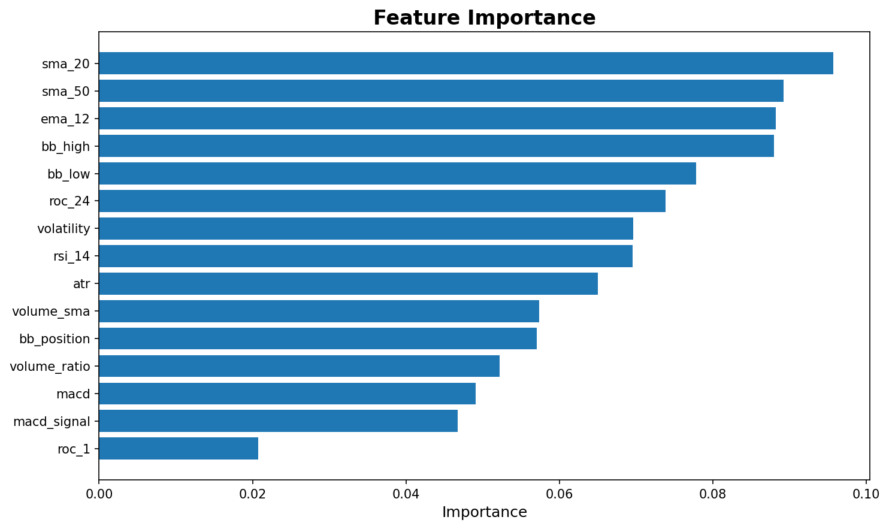
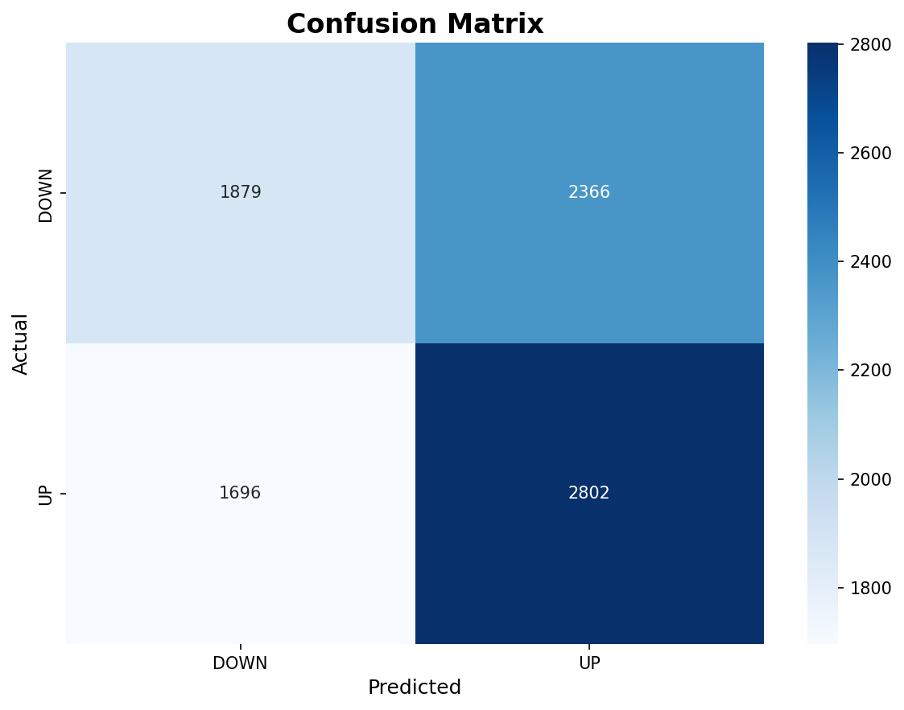

# BTC Price Prediction with XGBoost

## 📖 Project Overview

This project implements a complete machine learning pipeline for Bitcoin price prediction using XGBoost classifier and FastAPI deployment.

I fetch **5 years of hourly BTC data** from Binance API, engineer **15 technical indicators**, train an XGBoost model with proper **time-based validation**, and deploy it via a FastAPI backend for real-time predictions.

The model predicts whether BTC price will go **UP or DOWN** in the next **24 hours**, achieving **53.54% accuracy** with honest evaluation showing the challenges of cryptocurrency price prediction.

---

## 🛠️ Tools and Libraries Used

### 💻 Programming & Environment
- **Python 3.8+**
- **Jupyter Notebook** – for experimentation (optional)

### 📦 Core Python Libraries
- **pandas, numpy** – data manipulation and processing
- **matplotlib, seaborn** – visualizations and plots
- **requests** – API calls to Binance

### 🤖 Machine Learning Libraries
- **scikit-learn** – train/test split, metrics, preprocessing
- **xgboost** – gradient boosting classifier (main model)
- **ta, pandas-ta** – technical analysis indicators

### 🌐 API & Deployment
- **FastAPI** – REST API backend
- **uvicorn** – ASGI server
- **pydantic** – data validation

### 📊 External Data Source
- **Binance API** – free historical OHLCV data (no authentication required)

---

## 🗂️ Project Folder Structure

```
btc-price-prediction/
├── data/
│   ├── btc_hourly_5y.csv          # 5 years of hourly OHLCV data (43,786 rows)
│   └── btc_features.csv           # Processed data with 15 technical indicators
│
├── models/
│   └── btc_xgboost_model.joblib   # Trained XGBoost classifier
│
├── results/
│   ├── training_progress.png      # Train/Val/Test split visualization
│   ├── feature_importance.png     # Top 15 feature importance chart
│   ├── confusion_matrix.png       # Model performance breakdown
│   ├── feature_importance.csv     # Feature rankings
│   └── metrics.json               # Precision, Recall, F1, Accuracy, ROC-AUC
│
├── src/
│   ├── data_fetcher.py            # Fetch 5 years BTC data from Binance
│   ├── feature_engineering.py     # Create 15 technical indicators
│   ├── model_training.py          # Train XGBoost with time-based split
│   └── api.py                     # FastAPI backend for predictions
│
├── run_pipeline.py                # Complete ML pipeline (data → features → model)
├── test_api.py                    # API testing suite
├── requirements.txt               # Python dependencies
└── README.md                      # Project documentation
```

---

## 🔄 Process Flow

### 1️⃣ Data Collection
- Fetch **5 years (2021-2026)** of hourly BTC data using Binance API
- **43,786 data points** with OHLCV (Open, High, Low, Close, Volume)
- Automated with progress tracking
- Script: `src/data_fetcher.py`

### 2️⃣ Feature Engineering
Create **15 technical indicators** across 5 categories:
- **Momentum**: RSI (14), ROC (1h, 24h)
- **Trend**: MACD, MACD Signal, SMA (20, 50), EMA (12)
- **Volatility**: Bollinger Bands (High, Low, Position), ATR, Volatility
- **Volume**: Volume SMA, Volume Ratio

**Why these features?**
- Based on proven technical analysis
- Cover different market aspects
- Each has clear financial interpretation
- Script: `src/feature_engineering.py`

### 3️⃣ Target Variable Definition
- **Binary Classification**: 0 = DOWN, 1 = UP
- **Logic**: If `price[t+24h] > price[t]` → UP (1), else DOWN (0)
- **Horizon**: 24 hours (practical for daily trading decisions)

### 4️⃣ Model Training
- **Algorithm**: XGBoost Classifier
- **Validation**: Time-based split (70% train, 10% validation, 20% test)
- **NO random shuffling** – respects temporal order to prevent data leakage
- **Hyperparameter Tuning**: 6 parameters optimized via TimeSeriesSplit CV
  - max_depth, learning_rate, n_estimators, min_child_weight, subsample, colsample_bytree
- Script: `src/model_training.py`

### 5️⃣ Model Evaluation
**Metrics (Test Set)**:
- **Accuracy**: 53.54%
- **Precision (UP)**: 54.22% | (DOWN): 52.56%
- **Recall (UP)**: 62.29% | (DOWN): 44.26%
- **F1 Score (UP)**: 57.98% | (DOWN): 48.06%
- **ROC AUC**: 0.5533

### 6️⃣ API Deployment
- **FastAPI** backend serving the trained model
- **5 endpoints**: health check, predictions, model info, features list
- **Interactive Swagger UI** at `/docs`
- Script: `src/api.py`

---

## 📊 Visualizations

### 🔹 Data Separation Chart


**What it shows**:
- Clear train (70%) / validation (10%) / test (20%) split
- Demonstrates proper time-based validation

---

### 🔹 Feature Importance


**Top 5 Features**:
1. **SMA 20** (9.6%) – 20-period moving average
2. **SMA 50** (8.9%) – 50-period moving average
3. **EMA 12** (8.8%) – Exponential moving average
4. **BB High** (8.8%) – Bollinger Band upper bound
5. **BB Low** (7.8%) – Bollinger Band lower bound

**Insight**: Moving averages and volatility indicators are most predictive!

---

### 🔹 Confusion Matrix


**Performance Breakdown**:
```
              Predicted
              DOWN    UP
Actual DOWN   1879   2366    (44% correct)
       UP     1696   2802    (62% correct)
```

**Key Finding**: Model better at predicting UP moves (62% recall) than DOWN moves (44% recall)

---

## ⚙️ Installation & Setup

### Prerequisites
- Python 3.8 or higher
- pip (Python package manager)
- Git

### Step 1: Clone the Repository
```bash
git clone <repository-url>
cd btc-price-prediction
```

### Step 2: Create Virtual Environment (Recommended)
```bash
# Create virtual environment
python -m venv venv

# Activate it
# Windows:
venv\Scripts\activate
# macOS/Linux:
source venv/bin/activate
```

### Step 3: Install Dependencies
```bash
pip install -r requirements.txt
```

### Step 4: Run the Complete Pipeline
```bash
python run_pipeline.py
```

**This will**:
- ✅ Fetch 5 years of BTC data from Binance
- ✅ Create 15 technical indicators
- ✅ Train XGBoost model with hyperparameter tuning
- ✅ Generate evaluation plots and metrics
- ✅ Save trained model (takes 5-10 minutes)

### Step 5: Start the API
```bash
python src/api.py
```

**API will be available at**:
- Main: http://localhost:8000
- Interactive Swagger UI: http://localhost:8000/docs

### Step 6: Test the API
```bash
# Option 1: Run test suite
python test_api.py

# Option 2: Manual testing
curl http://localhost:8000/health
curl http://localhost:8000/predict/latest

# Option 3: Open Swagger UI in browser
# Go to: http://localhost:8000/docs
```

---

## 🔍 Key Technical Details

### Why Time-Based Split?
❌ **Random Split Problem**: Uses future data to predict past (data leakage!)
✅ **Time-Based Split**: Train on past → Test on future (realistic)

**Critical for financial data**:
- Prevents overfitting to future patterns
- Mimics real trading scenario
- Honest performance evaluation

### Why XGBoost?
- State-of-the-art for tabular data
- Handles non-linear patterns
- Built-in regularization
- Feature importance analysis
- Fast training and prediction

### Model Limitations
The model achieves **53.54% accuracy** (only slightly better than random 50%), which means:
- ❌ **Not suitable for live trading** without improvements
- ❌ Transaction costs (0.2-0.8%) would eliminate profit
- ❌ Predicts direction only, not magnitude
- ✅ Demonstrates proper ML methodology
- ✅ Honest evaluation of challenges

---

## 💡 Trading Viability Discussion

### Is This Model Good Enough for Trading?
**Answer: NO**

**Reasons**:
1. **Accuracy too close to random** (53% vs 50% baseline)
2. **Transaction costs** (exchange fees + slippage) exceed the edge
3. **Direction only** – doesn't predict price magnitude
4. **High false positives** – 2,366 incorrect UP predictions
5. **No risk management** – no stop-loss or position sizing

### What Would Be Needed?
- Improve accuracy to 60%+ consistently
- Add sentiment analysis and on-chain metrics
- Implement risk management strategies
- Extensive backtesting with real costs
- 3-6 months of paper trading validation

### Key Insight
**Cryptocurrency price prediction is extremely difficult** because:
- Markets are highly efficient
- Too many unpredictable factors
- High noise-to-signal ratio
- Regime changes and black swan events

---

## 🛠️ Troubleshooting

**Issue**: Module not found errors
```bash
pip install -r requirements.txt
```

**Issue**: API won't start - "Model not loaded"
```bash
# Train the model first
python run_pipeline.py
```

**Issue**: Data fetching fails
- Check internet connection
- Binance API is free (no auth needed)
- Try different network if blocked

**Issue**: Port 8000 already in use
```bash
uvicorn src.api:app --reload --port 8001
```

---

## ✅ Conclusion

This **end-to-end machine learning system** demonstrates:
- ✅ Complete pipeline from data collection to API deployment
- ✅ Proper time-series validation methodology
- ✅ Comprehensive feature engineering with 15 indicators
- ✅ Systematic hyperparameter tuning
- ✅ Production-ready FastAPI backend
- ✅ **Honest evaluation** showing crypto prediction challenges

While the model shows **crypto price prediction is extremely difficult** (53% accuracy), it successfully demonstrates professional ML practices, proper validation techniques, and real-world deployment.

**Key Takeaway**: This project is excellent for learning ML and API deployment, but the model would need significant improvements before considering any trading applications.

---

## ⚠️ Disclaimer

**IMPORTANT**: This software is for **educational purposes only**.

- ❌ NOT financial advice
- ❌ NOT investment recommendation  
- ⚠️ Past performance ≠ future results
- ⚠️ Cryptocurrency trading carries significant risk
- ⚠️ You can lose all invested capital

**DO NOT use this model for live trading without extensive improvements and testing.**

---

## Acknowledgments

- **Binance API** – Free historical cryptocurrency data
- **XGBoost** – Excellent gradient boosting library
- **FastAPI** – Modern, fast web framework
- **TA-Lib** – Technical analysis indicators

---
